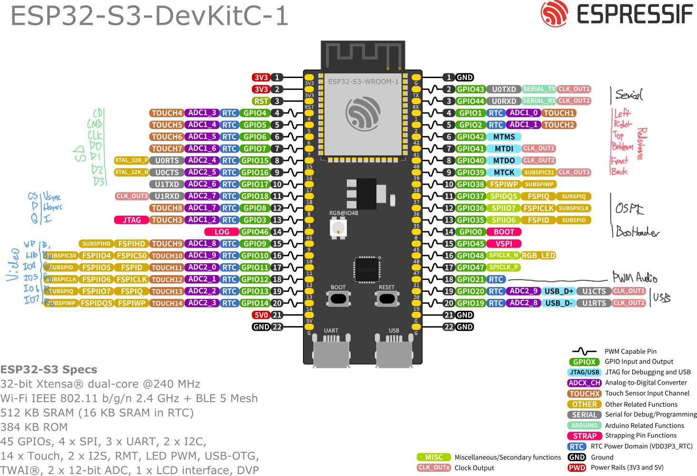

# CraftOS-ESP
A port of CraftOS-PC for ESP32-S3.

## Features
- CC: Tweaked 1.109.2 emulation
  - Lua 5.2 runtime
- VGA terminal display with 53x22 resolution
  - 320x200 logical resolution
  - 640x400@85Hz output mode
  - 80 possible colors, 16 used
- USB port for keyboard input
  - Supports all keys
  - Does not support keyboards with internal USB hubs
- Supports reading and writing internal and external files
  - 2 MB internal storage (can be expanded on modules with more flash)
  - SD card slot for external storage, mounted as disk drive at `/disk`
- Wi-Fi/HTTP connectivity
  - Use the `wifi` command to connect to a network
  - Wi-Fi configuration is saved and automatically re-connected on boot
  - HTTP/HTTPS supported
- Audio out through speaker peripheral
  - Mono PWM audio output
  - May not be viable due to memory constraints
- Modem communication over BTLE
- OTA updates

## Requirements
- System: ESP32-S3 module with 16+ MB flash, 2+ MB PSRAM (32/8 ideal)
- VGA: VGA breakout port/connector and a resistor bridge for DACs (reference: 3x ~710 ohm + 6x ~1400 ohm)
- SD: SD/microSD breakout/port with full SD pins (no SPI only boards)
- Audio: 3.5mm jack, RC filter over PWM output recommended
- USB: USB-A port/breakout (devkit USB port doesn't supply power, so USB-OTG won't work)

## Wiring

## License
CraftOS-ESP and craftos2-lua are licensed under the MIT License.  
craftos2-rom is licensed under the Mozilla Public License and the ComputerCraft Public License.  
CraftOS-ESP contains portions of code from ESP-IDF, which is licensed under the Apache 2.0 License.  
